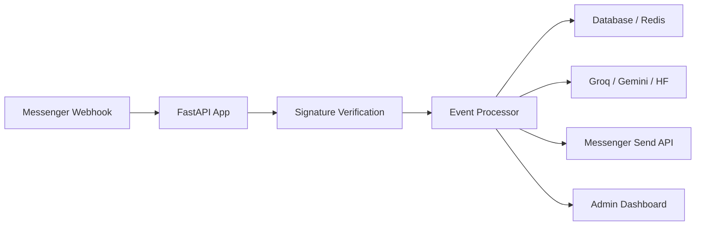

# Architecture

## System overview
The application is a webhook-driven backend service. Facebook Messenger sends events to the FastAPI app, the webhook layer validates and queues them, and a central processor dispatches work to domain services.

## Frontend architecture
There is no traditional frontend SPA. The repository uses:
- a lightweight admin dashboard served as static HTML files from the static directory
- Messenger-native quick replies and conversational UI through the Facebook Send API

## Backend architecture
- Entry point: main.py
- Request routing: handlers/
- Business logic: services/
- Data access: db/
- Shared utilities: utils/

## Database architecture
- PostgreSQL stores persistent entities such as users, feature flags, and processed webhook events.
- Redis stores transient state such as messaging windows, conversation history, and rate-limit counters.

## Authentication flow
- Incoming webhook requests are authenticated through signed payload verification.
- Admin dashboard uses signed session cookies backed by a server-side secret.
- Admin claims are granted through a bootstrap secret that is checked against an environment variable.

## API flow
1. Webhook receives request.
2. Signature is validated before parsing.
3. Events are queued for background processing.
4. The event processor performs idempotency checks and dispatches actions.
5. Replies are sent back through the Messenger Send API.

## State management
- Long-lived state is stored in Postgres.
- Short-lived or high-churn data is stored in Redis.
- Feature toggles are stored in the database so they can be changed at runtime without redeploying.

## Service layer
The services directory hosts the domain logic for:
- AI providers
- messaging
- image generation/storage
- admin actions
- weather/currency helpers
- rate limiting and conversation history

## External integrations
- Facebook Messenger Graph API
- Groq for chat, tool calling, and transcription
- Gemini for vision/OCR
- Hugging Face for image generation
- Supabase Storage for hosted generated images
- Render for deployment
