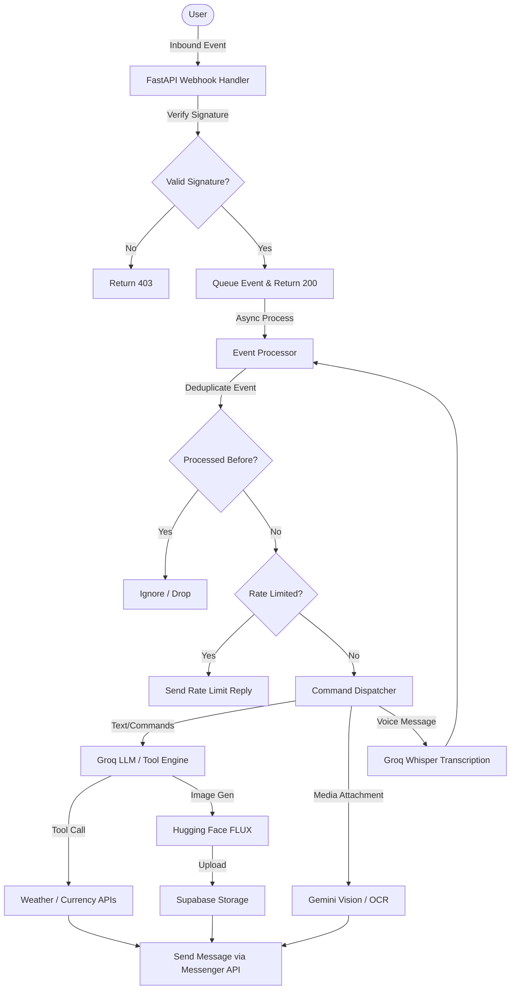

# Lucifer — Facebook Messenger AI Assistant

A production-grade AI assistant bot for Facebook Messenger, built with FastAPI, Groq (text chat, transcription, translation, and tool calling), Google Gemini (vision and OCR), and Hugging Face FLUX (image generation). Deployed on Render with Neon Postgres and Upstash Redis.

For the historical step-by-step rebuild roadmap and phase logs, see [HISTORY.md](file:///f:/Code/Python%20Code/lucifer/lucifer%20for%20messenger/HISTORY.md).

---

## Features

| Capability | Details |
|---|---|
| 🤖 **AI Chat** | Powered by Groq (`openai/gpt-oss-120b`, with fallback to `openai/gpt-oss-20b`) |
| 🛠️ **Tool Calling** | Groq automatically invokes helper tools (weather, currency exchange, image generation, or translation) in a single turn to minimize latency |
| 🖼️ **Image Understanding** | Responds to image uploads using Google Gemini 2.5 Flash |
| 🎨 **Image Generation** | Generates images via Hugging Face FLUX.1-schnell and uploads them to Supabase Storage |
| 🔍 **OCR** | Extracts literal text from photos via Google Gemini vision |
| 🌐 **Translation** | Translates text to/from major languages via Groq |
| 💡 **AI Text Tools** | Specialized commands `/explain`, `/summarize`, and `/rewrite` powered by Groq |
| 🎙️ **Voice Messages** | Transcribes voice recordings via Groq Whisper and routes the text through the standard interaction pipeline |
| 🎭 **Personas** | Dynamically switches system prompts (default, teacher, friend, coder) persisted per-user in PostgreSQL |
| 🌦️ **Weather Summary** | Fetches live weather conditions via OpenWeatherMap (cached for 10 minutes in Redis) |
| 💱 **Currency Exchange** | Performs conversions via the Frankfurter API using ECB reference rates |
| 📋 **Interactive Menu** | Guides non-technical users via custom Quick Reply menus |
| 🛡️ **Moderation & Safety** | Rate-limits users (8 requests per 60 seconds) in Redis, with admin controls to block/unblock users |
| 🔑 **In-Chat Admin Panel** | Rich, interactive console for administrators to view statistics, manage users, and toggle features |
| 💬 **Conversation History** | Manages a rolling history window of 20 turns per user in Redis |
| 🔁 **Idempotent Webhooks** | Guards against duplicate events using Postgres atomic constraints |
| 🔒 **Signature Verification** | Authenticates inbound Facebook payloads with `X-Hub-Signature-256` verification |
| ⚡ **Feature Flags** | Postgres-backed feature flags to disable/enable capabilities dynamically without redeployment |
| 🏥 **Health Checks** | `/healthz` verifies network connectivity to Postgres and Redis and reports the installed `yt-dlp` package version |

---

## Bot Commands

| Command | Description |
|---|---|
| `/persona` | List all available personas |
| `/persona <name>` | Switch to a different assistant personality |
| `/image <description>` | Generate an image from a text prompt |
| `/ocr` *(with photo attachment)* | Extract text from the attached photo |
| `/translate <language> <text>` | Translate text into the specified language |
| `/explain <text>` | Get a simple, clear explanation of a topic |
| `/summarize <text>` | Get a concise summary of a text |
| `/rewrite <text>` | Rewrite text for clarity and style |
| `/weather <city>` | Look up live weather conditions (cached) |
| `/currency <amount> <from> <to>` | Convert currency using ECB reference rates |
| `/download <url>` | Download a video (TikTok, Twitter/X, Instagram, Facebook, Reddit) |
| `/help` *(or* `/menu`*, or* `help`*)* | Open the interactive Quick Reply help menu |
| `/admin claim <secret>` | Claim admin access using the bootstrap secret |
| `/admin` | Open the interactive admin console (Admins only) |
| `/admin stats` | View system stats (Admins only) |
| `/admin block <psid>` | Block a user by Page-Scoped ID (Admins only) |
| `/admin unblock <psid>` | Unblock a user by Page-Scoped ID (Admins only) |

- **Voice messages** are transcribed and run through command routing or chat automatically.
- **Natural language** queries (e.g. "What's the weather in Paris?") are automatically intercepted by the tool-calling engine.

---

## Feature Flags

Every capability is gated by a row in the `feature_flags` table in PostgreSQL. Setting `enabled = false` for any key disables that feature immediately:

| Flag key | Controls |
|---|---|
| `ai_chat` | Main AI chat replies and text helpers (`/explain`, `/summarize`, `/rewrite`) |
| `image_gen` | `/image` command and image generation tool calling |
| `ocr` | `/ocr` command and vision text extraction |
| `translate` | `/translate` command and translation tool calling |
| `voice_input` | Voice message transcription |
| `weather` | `/weather` command and weather tool calling |
| `currency` | `/currency` command and currency tool calling |
| `downloader` | `/download` video downloads |

---

## Architecture Overview

Inbound webhook events from Facebook Messenger follow a clean, non-blocking pipeline:



1. **FastAPI Webhook (`/webhook`)**: Ingests HTTP payloads, authenticates signatures via HMAC SHA256, parses the JSON envelope, and delegates event handling to the `services.task_registry` background task pool. It returns a `200 OK` response to Facebook immediately, avoiding timeout retries.
2. **Event Processing (`event_processor.py`)**: Runs in the background. It executes user upsert and event logging inside an atomic Postgres transaction using `ON CONFLICT DO NOTHING RETURNING` to discard duplicate payloads.
3. **Command Dispatcher**: Checks for registered commands (like `/image`, `/ocr`, `/persona`) or falls back to natural language chat.
4. **AI & Utility Integration**: Combines Groq (primary LLM for chat and tools dispatching), Gemini (for visual understanding and OCR), Hugging Face (FLUX.1-schnell for image generation), and external APIs (OpenWeatherMap, Frankfurter).
5. **Response Delivery (`messenger_api.py`)**: Sends results back to the user via the Facebook Messenger Send API, chunking text automatically to satisfy the 2000-character Messenger limit.

---

## Architectural Decisions

A set of key technical design decisions and trade-offs governs this codebase:

* **Direct `asyncpg` SQL over an ORM**: To keep execution fast, predictable, and clean of heavy dependency boilerplate, we use raw SQL parameterized queries executed directly on an `asyncpg` connection pool. This makes primary-key lookups and upsert statements complete in sub-milliseconds.
* **No Durable Queue for Webhook Events**: Webhooks are dispatched straight into memory using `asyncio.create_task`. While a crash or restart could lose in-flight tasks, memory-based queueing offers sub-millisecond response latency and removes complex broker dependencies. Graceful shutdown drains task pools for up to 90 seconds to minimize losses during deployments.
* **Why YouTube is Not Supported**: The video downloader is restricted to platforms that do not mandate external JS runtime signatures (e.g., TikTok, Instagram, Reddit). Downloading from YouTube requires a JavaScript interpreter (Node/Deno) which is not part of this lightweight Python container build.
* **FLUX.1-schnell for Image Generation**: We use the `FLUX.1-schnell` model under the Apache 2.0 license, which permits commercial use. The higher-quality `FLUX.1-dev` model is explicitly avoided due to its non-commercial licensing constraints.
* **Fixed-Window Redis Rate Limiting**: The rate-limiting logic uses a simple `INCR` + `EXPIRE` window in Redis. While a true sliding window using sorted-set timestamps prevents "double-dipping" at the boundary, it requires several extra round-trips and complex cleanups. The O(1) fixed-window implementation provides high performance and sufficient burst protection.

---

## Tech Stack

| Layer | Technology |
|---|---|
| **Runtime** | Python 3.11 |
| **Web Framework** | FastAPI + Uvicorn |
| **Database** | PostgreSQL via `asyncpg` (Neon / local) |
| **Cache / History** | Redis via `redis.asyncio` (Upstash / local) |
| **Text AI** | Groq (`openai/gpt-oss-120b`, fallback: `openai/gpt-oss-20b`) |
| **Vision AI** | Google Gemini 2.5 Flash |
| **Image Generation** | Hugging Face FLUX.1-schnell |
| **Transcription** | Groq Whisper (`whisper-large-v3-turbo`) |
| **Image Storage** | Supabase Storage (`generated-images` and `downloads` buckets) |
| **Hosting** | Render |
| **Retry Logic** | `tenacity` |
| **Config** | `pydantic-settings` |

---

## Project Structure

```
.
├── main.py                    # FastAPI application, lifespan, health checks
├── config.py                  # Typed configuration (pydantic-settings)
├── requirements.txt           # Application dependencies
├── Procfile                   # Process configuration for deployment
├── render.yaml                # Render blueprint configuration
├── runtime.txt                # Python runtime definition
├── .env.example               # Environment variables template
│
├── db/
│   ├── postgres.py            # PostgreSQL connection pooling with tenacity retries
│   └── redis_client.py        # Redis client initialization with tenacity retries
│
├── handlers/
│   └── webhook.py             # Messenger webhook verification and event receivers
│
├── migrations/
│   ├── 0001_init.sql          # Core tables: users, feature_flags, processed_webhook_events
│   └── 0002_admin.sql         # Admin bootstrap column
│
├── scripts/
│   ├── run_migrations.py      # Idempotent migration runner
│   └── sign_test_payload.py   # Signature validation testing utility
│
├── services/
│   ├── event_processor.py     # Routing hub: command dispatching, tool calling, help menus
│   ├── groq_client.py         # Groq client wrapper: chat completions and Whisper audio
│   ├── gemini_vision.py       # Google Gemini vision: photo descriptions and OCR
│   ├── image_gen.py           # Hugging Face FLUX.1 image generation
│   ├── storage.py             # Supabase storage: generated image and video uploads
│   ├── ocr.py                 # OCR helper reusing gemini_vision
│   ├── translate.py           # Translation service using Groq
│   ├── ai_tools.py            # Explaining, summarizing, and rewriting services
│   ├── weather.py             # OpenWeatherMap API integration (Redis cached)
│   ├── currency.py            # Frankfurter API converter
│   ├── admin.py               # Administrative actions, stats, blocklists
│   ├── messenger_api.py       # Messenger Send API client (text, images, quick replies, videos)
│   ├── chat_history.py        # Redis sliding window chat history
│   ├── personas.py            # Persona system prompt registry
│   ├── feature_flags.py       # Feature flag database checks
│   ├── messaging_window.py    # Facebook 24-hour window tracker (Redis)
│   └── rate_limit.py          # Sliding-window rate limit (Redis)
│
├── utils/
│   ├── logger.py              # Structured stdout logger
│   └── security.py            # HMAC signature verification & session tokens
│
└── tests/
    ├── conftest.py            # Async fakes and pytest fixtures
    ├── test_phase1_infra.py   # Core infra tests: configuration, signature checks, logger
    ├── test_phase2_webhook.py # Webhook handshake and event ingestion tests
    ├── test_phase3_ai_core.py # Core chat flows: Groq responses, Gemini vision, rate limits
    ├── test_phase4_ai_tools.py# AI Tools tests: OCR, Whisper, translation, image generation
    ├── test_phase5_utilities.py# Utilities tests: weather and currency converters
    ├── test_admin_phase6a.py  # Admin authorization and command logic tests
    ├── test_admin_dashboard_phase6b.py # Web admin dashboard session and limit tests
    ├── test_phase6b_ux.py     # Tool dispatching and help menu flow tests
    └── test_phase8_hardening.py# Graceful shutdown, sentry capture, and event cleanup tests
```

---

## Quick Start

### 1. Clone & Setup Virtual Environment

```bash
git clone <repo-url>
cd <repo-dir>
python -m venv .venv

# Windows
.venv\Scripts\activate
# macOS / Linux
source .venv/bin/activate
```

### 2. Install Dependencies

```bash
pip install -r requirements.txt
```

### 3. Configure Environment Variables

```bash
cp .env.example .env
```

| Variable | Required | Where to get it |
|---|---|---|
| `DATABASE_URL` | Yes | Neon / Supabase database connection string |
| `REDIS_URL` | Yes | Upstash Redis connection string |
| `FB_PAGE_ACCESS_TOKEN`| Yes | Meta Developer App Messenger settings |
| `FB_APP_SECRET` | Yes | Meta Developer App settings |
| `FB_VERIFY_TOKEN` | Yes | Custom secret string of your choice |
| `FB_PAGE_ID` | Yes | Facebook Page ID |
| `GROQ_API_KEY` | Yes | Groq console API key |
| `GEMINI_API_KEY` | Yes | Google AI Studio API key |
| `HF_API_KEY` | Yes | Hugging Face user settings token |
| `SUPABASE_URL` | Yes | Supabase project API settings |
| `SUPABASE_SERVICE_KEY`| Yes | Supabase project service role key |
| `OPENWEATHER_API_KEY` | Yes | OpenWeatherMap API key |
| `ADMIN_BOOTSTRAP_SECRET`| Yes | Custom secure random string |

### 4. Setup Supabase Buckets

1. **generated-images**: In your Supabase project, go to **Storage → New bucket**, name it `generated-images`, and set it to **Public**.
2. **downloads**: Create a second bucket named `downloads` and set it to **Public** for media downloads.

### 5. Run Database Migrations

```bash
python scripts/run_migrations.py
```

### 6. Start the Server

```bash
uvicorn main:app --reload
```

### 7. Verify Connectivity

```bash
curl http://localhost:8000/healthz
# Expected: {"status":"ok","db":"ok","redis":"ok","ytdlp_version":"..."}
```

---

## Webhook Signature Verification testing

```bash
python scripts/sign_test_payload.py tests/fixtures/sample_message_event.json YOUR_APP_SECRET
```

Then post the output locally:

```bash
curl -X POST http://localhost:8000/webhook \
     -H "Content-Type: application/json" \
     -H "X-Hub-Signature-256: <output from above>" \
     --data-binary @tests/fixtures/sample_message_event.json
```

---

## Running the Tests

```bash
pytest tests/ -v
```

---

## License

MIT
